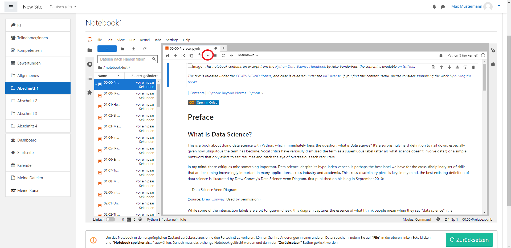
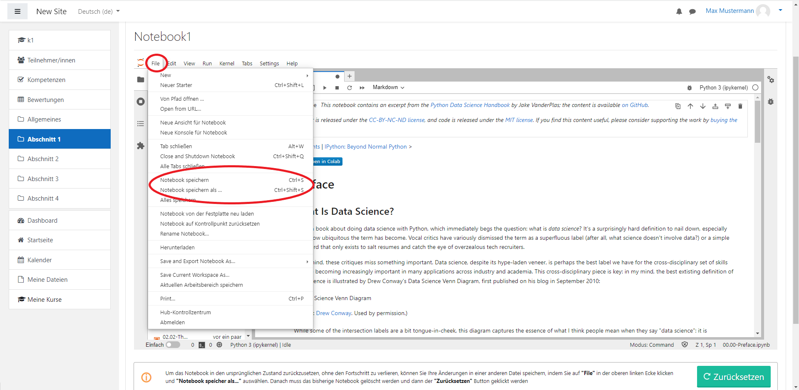
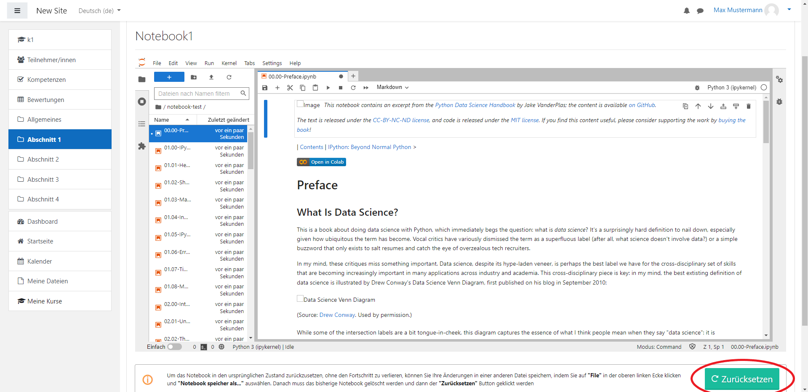
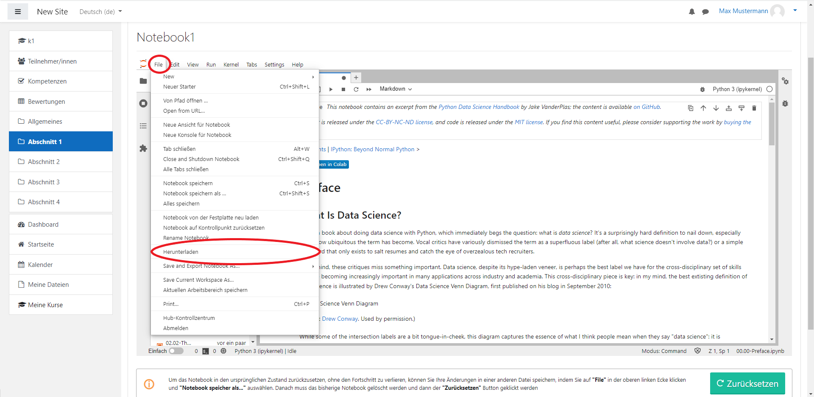
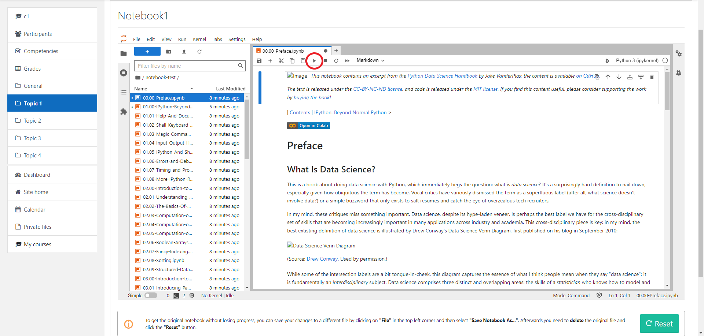
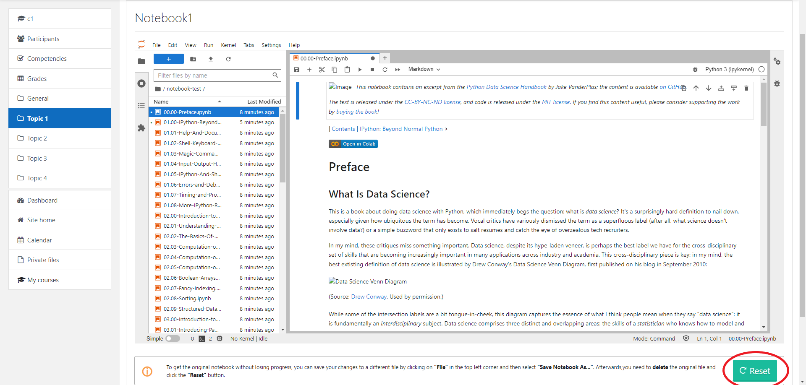

# Schüler Dokumentation / Student Documentation

## Deutsch
Dieses Dokument soll als Anleitung für Schüler und Schülerinnen dienen, die das __Jupyter Notebook__ Plugin in ihrem Moodle Kurs benutzen wollen.\
Es wird gezeigt, wie ein Schüler/eine Schülerin auf ein Kurs zugreifen kann sowie auf die dort liegenden __Jupyter Notebooks__.\
Die Funktionen die innerhalb eines __Jupyter Notebooks__ ausgeführt werden können, sind hier ebenfalls vertreten.

### Öffnen eines Jupyter Notebooks
Nachdem man sich angemeldet hat, kommt man auf dem Dashboard raus.
Hier klickt man links auf die Startseite, wo Sie dann die Ihnen zur Verfügung
stehenden Kurse sehen. Dort klicken Sie auf den richtigen Kurs. Falls eine Fehlermeldung kommt,
dass Sie diesem Kurs noch nicht zugewiesen worden sind, so melden Sie sich bitte bei dem jeweiligen Kursleiter.
In dem jeweiligen Kurs können Sie dann auf die korrekten Aktivität klicken.\
Diese bietet den Zugriff auf verschiedene __Jupyter Notebooks__.

### Funktionen in einem Jupyter Notebook
Nachdem das richtige Notebook ausgewählt wurde und man zu einer Aufgabe kommt, in der ein Code ausgeführt werden muss, kann dies
mit dem kleinen Dreieck oben gemacht werden. 

Zum Speichern eines Notebooks kann man entweder oben auf File drücken und dann manuell auswählen oder "Strg + S" drücken.\

Falls man ein Notebook neuladen möchte, nachdem man selbst schon Änderungen vorgenommen hat, muss man dieses erst unter anderem Namen speichern.
Dies kann wieder oben unter dem Reiter "File" gemacht werden oder mit "Strg + Umschalt + S".\
Danach muss man das alte __Jupyter Notebook__ löschen und den Zurücksetzen-Knopf unten drücken.\

Wenn man ein Notebook herunterladen möchte, klickt man wieder oben auf File und danach auf Herunterladen. Nun hat man die Datei lokal bei sich auf dem Rechner.

Bei allgemeinen Fragen zur Verwendung von __Jupyter Notebook__ kommen Sie [hier](https://jupyter-notebook.readthedocs.io/en/stable/)
auf die offizielle Juypter Notebook Dokumentation.

## English
This document is intended as a guide for students who want to use the __Jupyter Notebook__ plugin in their Moodle course.\
It shows how a student can access their course and the __Jupyter Notebooks__ located there.\
The functions that can be performed within a __Jupyter Notebook__ are also represented here.

### Opening a Jupyter Notebook
After logging in, you come out on the dashboard.
Here you click on the home page on the left, where you will see the courses available to you.
There you click on the right course. If you get an error message
that you have not yet been assigned to this course, please contact the respective course instructor.
You can then click on the correct activity in that course.\
This provides access to various __Jupyter Notebooks__.

### Functions in a Jupyter Notebook
After the correct notebook has been selected and you come to a task where some code needs to be executed, this can be
 done with the small triangle at the top.

To save a notebook you can either press file at the top and then select it manually or press "Ctrl + S".\

If you want to reload a notebook after you have already made changes yourself, you have to save it under a different name first.
This can be done again above under the tab "File" or with "Ctrl + Shift + S".\
After that you have to delete the old one and click the reset button at the bottom.\

If you want to download a notebook, click again on file and then on download. Now you have the file locally on your computer.

For general questions about using __Jupyter Notebook__, come [here](https://jupyter-notebook.readthedocs.io/en/stable/)
to the official Juypter Notebook documentation.
