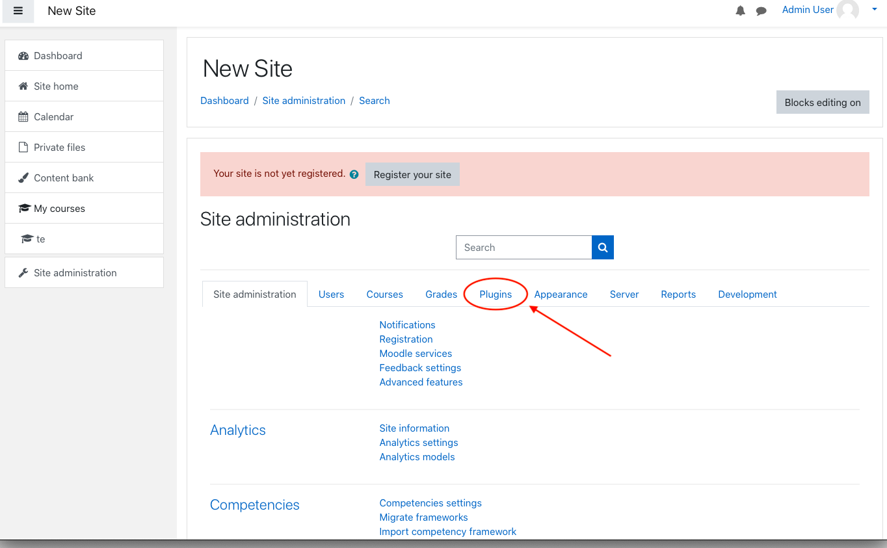
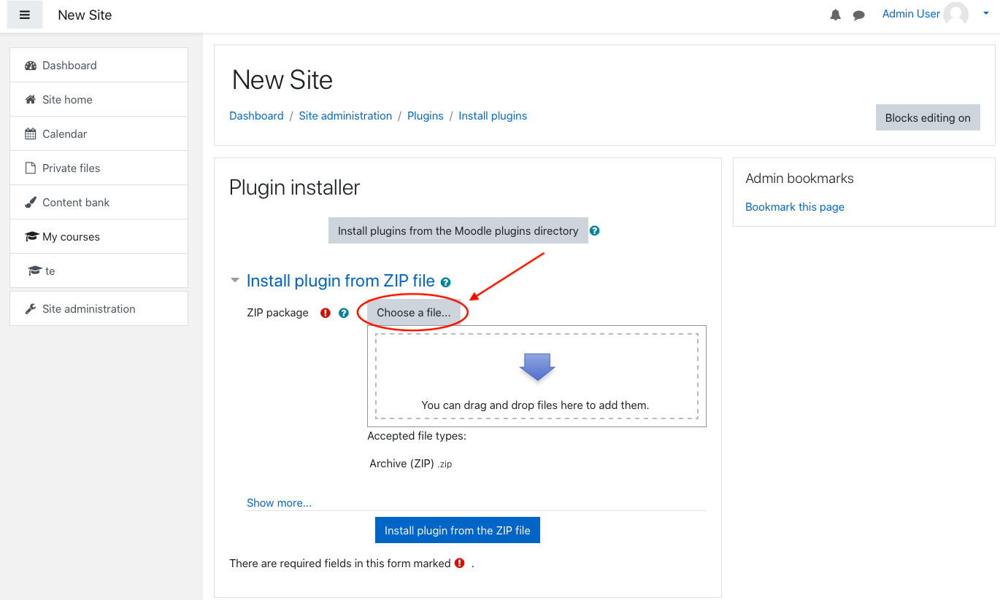

# Customer Documentation
This project can be found on a private [Gitlab server](https://sopra.informatik.uni-stuttgart.de/kib3-student-projects/kib3-stupro-ss-22) at the moment.
Project access must be granted by a maintainer.
There are two main directories to the project:
The first one is the __moodle_docker__ directory where one can host their own Moodle server.
It is mainly important for people who are setting up the servers for the users.
The second one is __jupyterhub_docker__, which is additionally important for the Plugin itself since it will be communicating with JupyterHub to spawn Jupyter Notebooks.

## Prerequisites
If you just want to use the plugin, no further prerequisites are needed.
If you want to host your own Moodle Server or JupyterHub server, you have to install Docker.

#### Installing Docker
For installing Docker follow the steps on this [page](https://docs.docker.com/get-docker/).

### Hosting Your Own Moodle Server
Make sure you are in the __moodle_docker__ folder.
From there, run
```shell
docker-compose up -d
```
to start the Docker container.

The web UI runs on [127.0.0.1:80](http://127.0.0.1:80).
Initial startup of the moodle-container usually takes a few minutes; as long as the Docker container is still running, you should be fine.
Initial credential are `user` as username and `bitnami` as password.

### Hosting Your Own JupyterHub server
First make sure you are in the __jupyterhub_docker__ folder.

To create volumes and network for persistent data, run
```shell
docker volume create --name=jupyterhub-data
docker volume create --name=jupyterhub-db-data
docker network create jupyterhub-network
```

Then to run Jupyterhub, run the following commands to start JupyterHub:
```shell
docker-compose build
docker-compose up
```

JupyterHub uses a JSON web token [authenticator](https://github.com/izihawa/jwtauthenticator_v2).  
- To test this setup, you can create a json web token on [this](https://jwt.io/#debugger-io) site.
In the `verify signature` field the secret can stay `your-256-bit-secret` as it is (the secret should match the one in the [environment file](.env) then).
`secret base64 encoded` should NOT be checked.
- You can now add the token as a query parameter to the address that your jupyterhub is running on (for example: http://127.0.0.1:8000/?auth_token=**your token here**).
- When using the plugin, however, these tokens are generated **automatically** based on the user's unique Moodle user name and are **not** required to be generated manually.

## Plugin
To use the plugin, a running instance of JupyterHub is needed (by default, it is accessible via port 8000).
### Install Plugin
1. Get a zip version the directory [Jupyter](https://sopra.informatik.uni-stuttgart.de/kib3-student-projects/kib3-stupro-ss-22/-/tree/main/jupyter).
2. Open and login to Moodle.
3. Go to __Site administration__.
   
4. Go to __Plugins__.
   
5. Click on __Install Plugins__.
   
6. Add the zip version via "Choose a file..." or "drag and drop".
7. Click on __"Install plugin from the ZIP file"__ button to install the plugin.
8. Click on __Continue__.
9. A page about current release information will appear. Scroll down and click on __Continue__ again.
10. The next page shows plugins that require your attention. To install the plugin, click on __Upgrade Moodle datebase now__.
11. The next page should confirm a successful installation. Click on __Continue__ to progress further.
12. Now the settings of the plugin will show up. Here you can enter the URL or IP and the port of the JupyterHub server (if the provided JupyterHub Docker setup is used, the default values will already be correct).
13. Click on __Save changes__ to finish the installation of the plugin.

## Usage of the Plugin for Teachers
### Create course
1. Get a zip file of the plugin.
2. Go to __Site Home__.
3. __Turn on editing__ in the settings.
   
4. Click on __"Add an activity or resource"__ and add the __Jupyter Hub__ Plugin as an activity.
   
5. To distribute Jupyter Notebook files to students enrolled in the course, you need to upload them to a remote git repository (i.e., [GitLab](https://gitlab.com/) or [GitHub](https://github.com/)). When including the plugin in a Moodle course, you need to provide the URL of the repository, the branch you want to use (the default branch is called `main`), and specify the file you want to be opened.
6. Save and return to the course overview.

### <a name="plugin_settings"></a>Plugin Settings
1. Go to __Site Administration__.
2. Open on __Plugins__.
3. Click on __Manages Activities__ which can be found under __Activity Modules__.
4. Find the Jupyter Plugin and click on it to find the settings.
   

### Uninstall the Plugin
1. Go to __Site administration__ > __Plugins__ > __Plugins overview__.
2. Look for __JupyterHub__ and press __Uninstall__.

## Usage of the Plugin for Students
Students can use this plugin to solve tasks provided by teachers. With this plugin, students do not need to open another browser tab and can work on their assignment within Moodle itself.

### Starting Over Without Losing Progress
If students decide they want to start from scratch again without losing progress, they can save their changes to a different file by clicking on __File__ in the top left corner and then select __Save Notebook As...__. Afterwards, they need to delete the original file and click the __Refresh__ button. 

## Troubleshooting
### Resetting Docker Containers
To setup Moodle and JupyterHub from the very start, open a terminal and run
```shell 
docker kill $(docker -a -q)
docker rm -f $(docker -a -q)
```
This will stop and delete all existing Docker containers. Also use the following command
```shell
docker system prune
```
to clear all volumes.

### Port is Already Used
On Linux use
```shell
sudo lsof -i -P | grep LISTEN | grep :<Insert Port>
```
or 
```shell
sudo lsof -i -P | grep LISTEN
```
to list all used ports and check which process occupies the port required for Moodle or JupyterHub. If this process is not important, you can run
```shell
sudo kill <PID>
```
where __<PID>__ refers to the ID of the process. This will clear the port for JupyterHub or Moodle (by default, JupyterHub uses ports 8000 and 8081 and Moodle uses ports 80 and 3306).

### Connection to JupyterHub Failed
Make sure that the plugin uses the correct URL for JupyterHub. This can be checked and changed in the [plugin settings](#plugin_settings).

### Getting an Overview Over Containers
If everything has been set up correctly, it should look similar to the image provided below. If users are active, they might spawn notebooks and the number of Docker containers increases, adding one or multiple containers named "jupyter-user".

