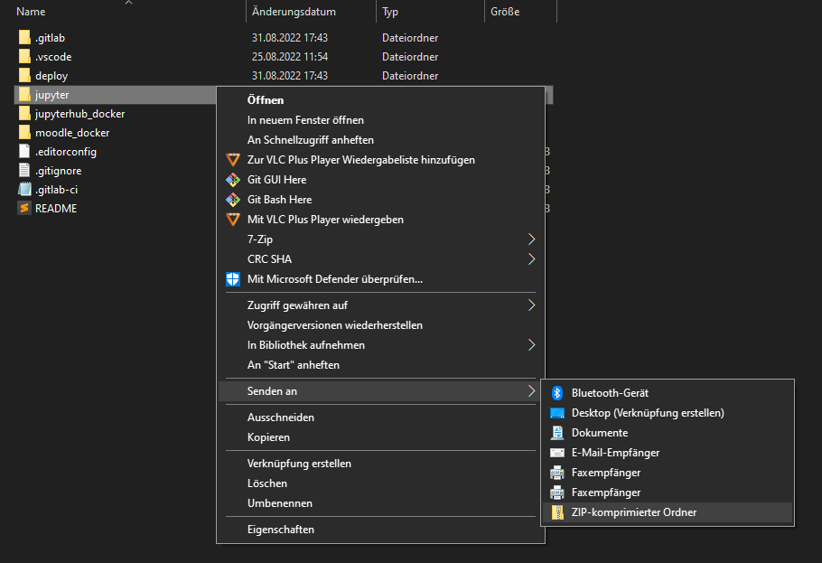
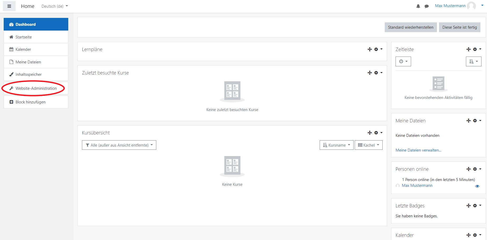
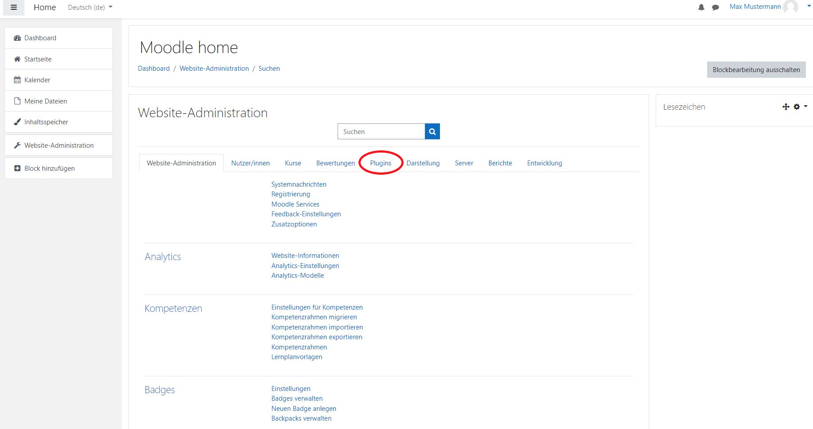
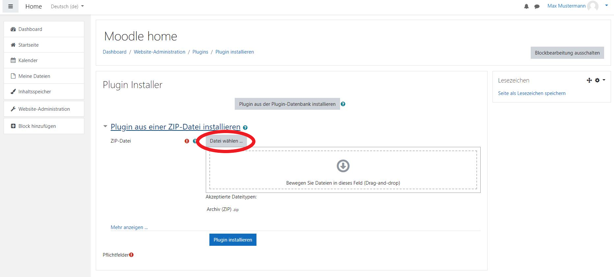
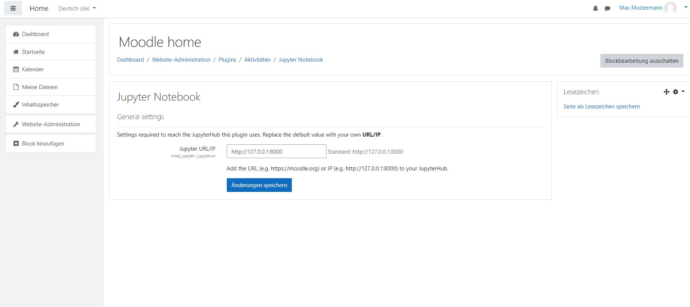
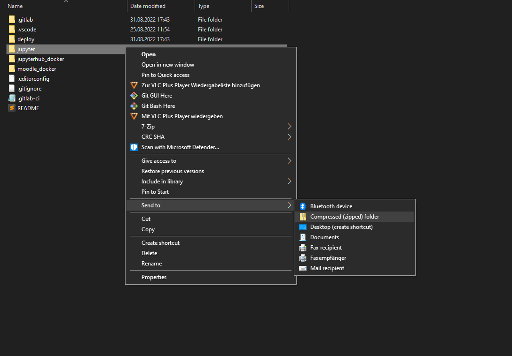
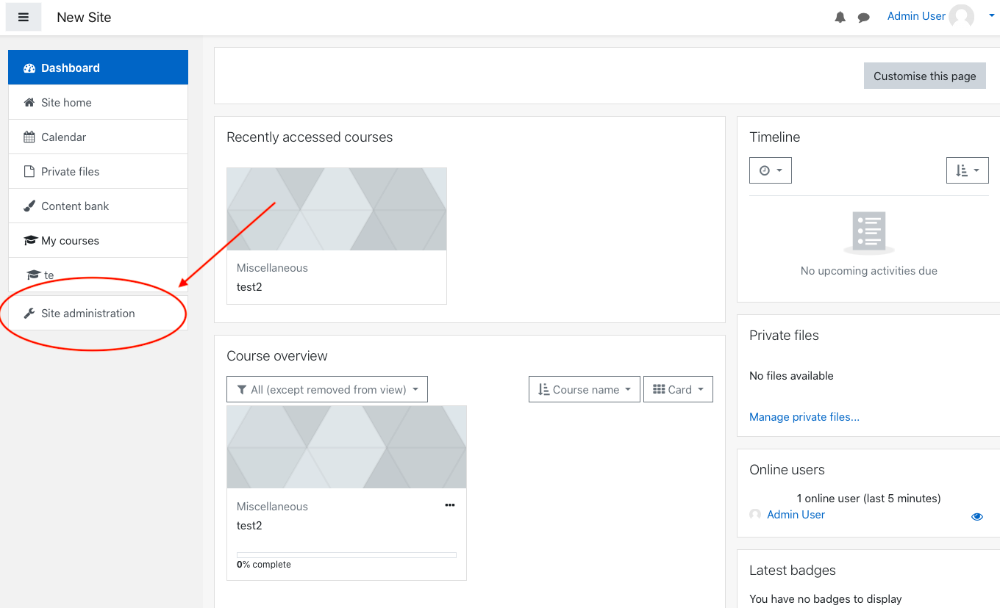
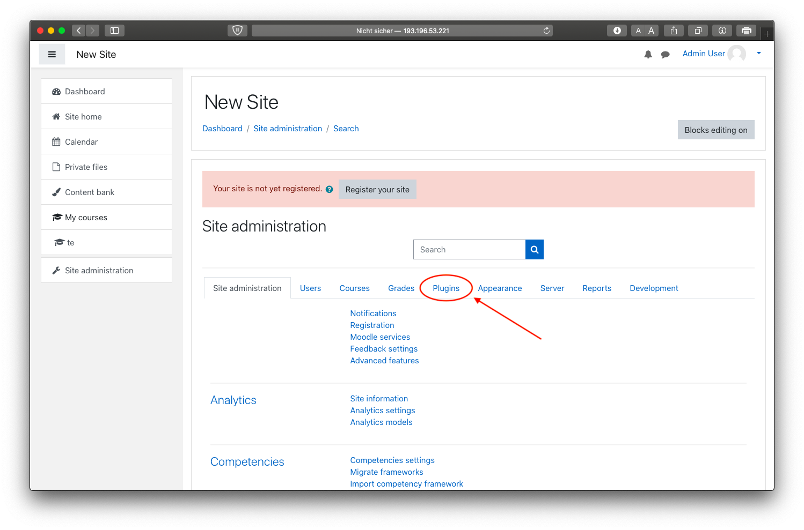
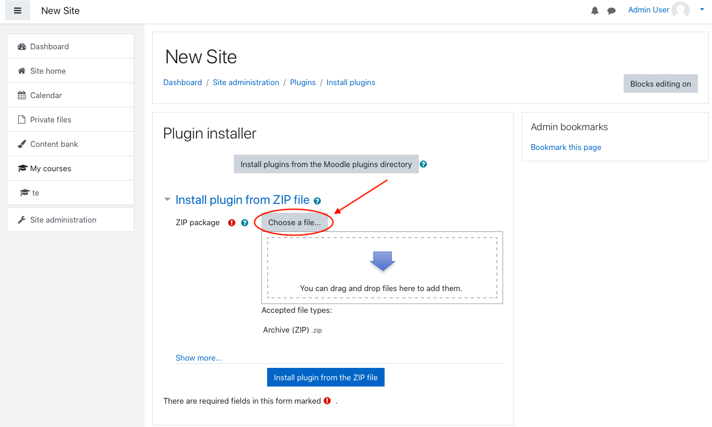
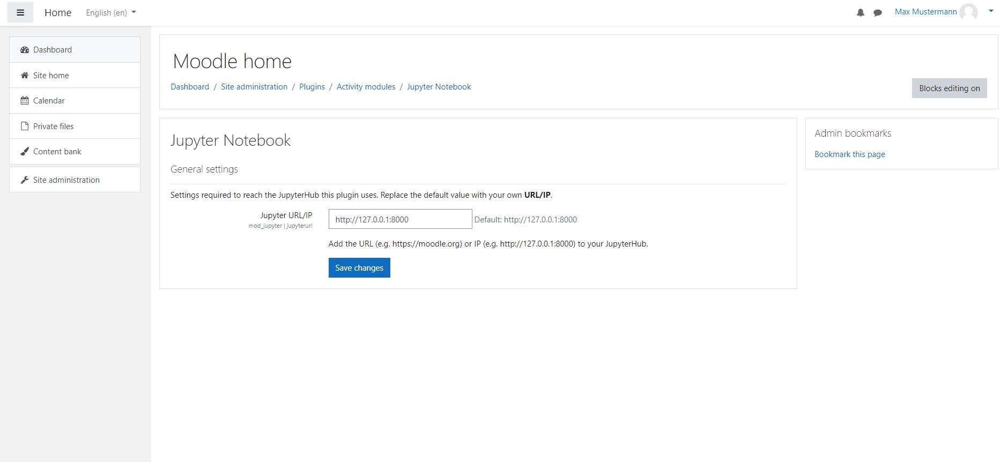

## Deutsch

### Voraussetzungen
Damit das Plugin funktioniert, ist ein JupyterHub-Server erforderlich. Sollte dieser noch nicht vorhanden sein, gibt es mehrere Möglichkeiten, diesen aufzusetzen:
1.  Mit Docker (eine detaillierte Installationsanleitung finden Sie [hier](https://docs.docker.com/engine/install/)) und dem bereitgestellten Setup im Ordner [`jupyterhub_docker`](https://sopra.informatik.uni-stuttgart.de/kib3-student-projects/kib3-stupro-ss-22/-/tree/main/jupyterhub_docker) (siehe [Setup mit Docker](#mitDocker)).
2.  Ohne Docker unter Verwendung der bereitgestellten Konfigurationsdateien (siehe [Setup ohne Docker](#ohneDocker)).

#### <a name="mitDocker"></a>Setup mit Docker
1.  Stellen Sie sicher, dass Docker installiert und gestartet ist (andernfalls funktioniert Schritt 4 nicht).
2.  Laden sie den Ordner `jupyterhub_docker` herunter und nehmen Sie folgende Änderungen vor:
    - Fügen Sie die URL Ihres Moodle-Servers in der Datei __jupyterhub_config.py__ (im Ordner `jupyterhub`) zur Attribut-Liste der 'Content-Security-Policy' (Zeile 33)  hinzu.
    - Fügen Sie die URL Ihres Moodle-Servers in der Datei __jupyter_notebook_config.py__ (im Ordner `jupyterlab`) zur Attribut-Liste der 'Content-Security-Policy' (Zeile 28) hinzu.
    - Setzen Sie in der Datei __.env__ ein *sicheres* Secret für die Authentifizierung (Zeile 15); eine Möglichkeit für das Generieren eines sicheren Secrets befindet sich in der Datei selbst (dieses Secret wird auch bei der Installation des Plugins benötigt).
3.  Öffnen Sie ein Terminal und navigieren Sie zum Ordner `jupyterhub_docker`.
4.  Führen Sie folgende Befehle aus:
    ``` shell
    docker compose build
    docker-compose up -d
    ```
5.  Der Server ist nun erreichbar unter 127.0.0.1:8000 bzw. 127.0.0.1:8081 (die Ports können in der Datei __docker-compose.yml__ angepasst werden); hier bekommen Sie allerdings eine '404 Unauthorized'-Antwort.
6.  Zum Testen können Sie [hier](https://jwt.io/#debugger-io) einen JSON Web Token generieren; dafür müssen Sie 'your-256-bit-secret' zum von Ihnen gesetzen Secret ändern. Anschließend sollten Sie den Server unter 127.0.0.1:8000/?auth_token=[Ihr Token] (ohne die eckigen Klammern) erreichen können und ein Notebook sollte erzeugt werden.

#### <a name="ohneDocker"></a>Setup ohne Docker
[Hier](https://jupyterhub.readthedocs.io/en/stable/) finden Sie eine ausführliche Dokumentation zu verschiedenen Möglichkeiten, einen JupyterHub-Server aufzusetzen (unter anderem die bekanntesten Distributionen [The Littlest JupyterHub](https://tljh.jupyter.org/en/latest/) für bis zu 100 Nutzer und [Zero to JupyterHub](https://zero-to-jupyterhub.readthedocs.io/en/latest/) für mehr Nutzer). Für diesen Anwendungsfall ist wichtig, dass die in diesem Projekt bereitgestellten Konfigurations-Dateien (__jupyterhub_config.py__ und __jupyter_notebook_config.py__) und die Environment-Datei (__.env__) übernommen werden.


### Installation des Plugins
1.  Erstellen Sie eine Zip-Datei vom Verzeichnis [Jupyter](https://sopra.informatik.uni-stuttgart.de/kib3-student-projects/kib3-stupro-ss-22/-/tree/main/jupyter). \
    Die Zip-Datei sollte ebenfalls "jupyter" genannt werden.
    
2.  Öffnen Sie Moodle und melden Sie sich mit einem Administrator-Profil an um weitere Einstellungen im Verlauf dieser Anleitung vorzunehmen.
3.  Klicken Sie auf  __Website-Administration__.
    
4.  Klicken Sie auf __Plugins__.
    
5.  Klicken Sie auf __Plugin installieren__.
6.  Fügen Sie die "jupyter.zip" datei via "Datei auswählen..." oder "drag and drop" hinzu.
    
7.  Klicken Sie auf den __Plugin installieren__ Button.
8.  Klicken Sie auf __Weiter__.
9.  Als nächstes erscheint eine Seite über aktuelle Veröffentlichungsinformationen. Scrollen Sie herunter und klicken Sie wieder auf __Weiter__.
10. Nun wird das zu installierende Plugin dargestellt. Um fortzufahren klicken Sie auf __Aktualisierung der Datenbank starten__.
11. Es sollte eine Erfolgsmeldung über die Installation des Plugins angezeigt werden. Drücken Sie auf __Weiter__ .
12. URL/IP settings werden angezeigt. Wenn das JupyterHub setup erfolgreich ausgeführt wurde, werden die vordefinierten Einstellungen bereits korrekt sein und Sie können fortfahren.\
    Falls ihr IT-Administrator Änderungen vorgenommen hat bezüglich einer anderen URL, können Sie hier eine neue URL bzw IP und port angeben für den JupyterHub Server.
13. Klicken Sie auf __Änderungen speichern__ um die Installation des Plugins abzuschließen.

### Plugin Einstellungen
1. Navigieren Sie zu __Website-Administration__.
2. Öffnen Sie __Plugins__.
3. Klicken Sie auf __Übersicht__ unter __Aktivitäten__.
4. Suchen Sie nach __Jupyter Notebook__ und klicken sie auf __Einstellungen__.
   

### Deinstallieren des Plugins
1. Navigieren Sie zu __Website-Administration__.
2. Öffnen Sie __Plugins__.
3. Klicken Sie auf __Übersicht__ unter __Aktivitäten__.
4. Suchen Sie nach __Jupyter Notebook__ und klicken sie auf __Deinstallieren__.


## English

### Prerequisites
For the plugin to work, a JupyterHub server is required. In case you do not have access to one, there are several possibilities for setting up a new one:
1.  With Docker (you can find a detailed installation guide [here](https://docs.docker.com/engine/install/)) and the provided setup in the [`jupyterhub_docker`](https://sopra.informatik.uni-stuttgart.de/kib3-student-projects/kib3-stupro-ss-22/-/tree/main/jupyterhub_docker) folder (see [Setup with Docker](#withDocker)).
2.  Without Docker using the povided configuration files (see [Setup without Docker](#withoutDocker)).

#### <a name="withDocker"></a>Setup with Docker
1.  Make sure Docker is installed correctly and running (otherwise, step 4 will not work).
2.  Download the folder `jupyterhub_docker` and make the following changes:
    - Add the URL of your Moodle server to the list of URLs of the 'Content-Security-Policy' attribute in the file __jupyterhub_config.py__ (within the `jupyterhub` folder).
    - Add the URL of your Moodle server to the list of URLs of the 'Content-Security-Policy' attribute in the file __jupyter_notebook_config.py__ (within the `jupyterlab` folder).
    - Set a *secure* secret for authentication in the __.env__ file (line 15); one possibility to generate a secure secret is provided within the file itself (this secret is also required when installing the plugin).
3.  Open a terminal and navigate to the `jupyterhub_docker` folder.
4.  Execute the following commands:
    ``` shell
    docker compose build
    docker-compose up -d
    ```
5.  The server is now accessible via 127.0.0.1:8000 or 127.0.0.1:8081 respectively (you can change the ports in the __docker-compose.yml__ file), but you will recieve a '401 unauthorized' response.
6.  To test whether everything is working properly, you can generate a JSON web token [here](https://jwt.io/#debugger-io); you need to replace 'your-256-bit-secret' with the secret you set in step 2. Afterwards, you should be able to reach the server via 127.0.0.1:8000/?auth_token=[insert your token] (without the square brackets) and a notebook should be spawned.

#### <a name="withoutDocker"></a>Setup without Docker
You can find a detailed documentation on different possibilities for how to run a JupyterHub server [here](https://jupyterhub.readthedocs.io/en/stable/) (among others, it features the popular distributions [The Littlest JupyterHub](https://tljh.jupyter.org/en/latest/) for up to 100 users, and [Zero to JupyterHub](https://zero-to-jupyterhub.readthedocs.io/en/latest/) for more users). In this case, it is important that you use the configuration files (__jupyterhub_config.py__ and __jupyter_notebook_config.py__) and the environment file (__.env__) that are provided in this project.

### Install Plugin
1.  Get a zip version the directory [Jupyter](https://sopra.informatik.uni-stuttgart.de/kib3-student-projects/kib3-stupro-ss-22/-/tree/main/jupyter).\
    The zip file has to be named "jupyter" as well.
    
2.  Open and log in to Moodle. You have to log in with an adminstrator account to set the following preferences.
3.  Click on __Site administration__.
    
4.  Click on __Plugins__.
    
5.  Click on __Install Plugins__.
6.  Add the "jupyter.zip" file via "Choose a file..." or "drag and drop".
    
7.  Click on __"Install plugin from the ZIP file"__ button to install the plugin.
8.  Click on __Continue__.
9.  A page about current release information will appear. Scroll down and click on __Continue__ again.
10. The next page displays the plugin you are about to install. To install the plugin, click on __Upgrade Moodle datebase now__.
11. The next page should confirm a successful installation. Click on __Continue__ to progress further.
12. Now the URL/IP settings of the plugin show. If the provided JupyterHub setup is set up and used, the default values will already be correct.\
    However, if your IT-administrator made changes to the configuration of the URL/IP you can enter a new URL or IP and the port of the JupyterHub server.
13. Click on __Save changes__ to finish the installation of the plugin.

### Plugin Settings
1. Go to __Site Administration__.
2. Open __Plugins__.
3. Click on __Manages Activities__ which can be found under __Activity Modules__.
4. Find the Jupyter Plugin and click __Settings__.
   

### Uninstall the Plugin
1. Go to __Site Administration__.
2. Open __Plugins__.
3. Click on __Manages Activities__ which can be found under __Activity Modules__.
4. Find the Jupyter Plugin and click on __Uninstall__.
