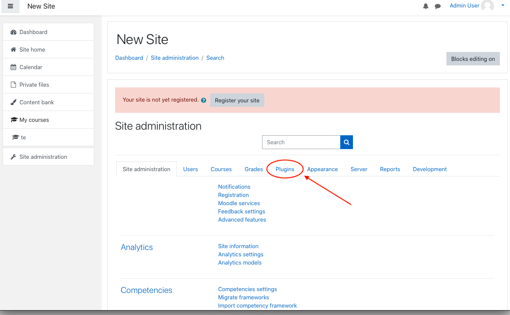
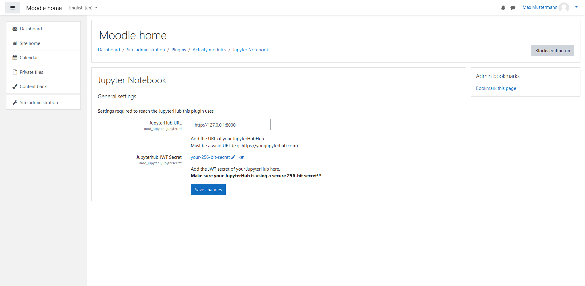

## Deutsch
### Installation des Plugins
1.  Erstelle eine Zip-Datei vom Verzeichnis [Jupyter](https://sopra.informatik.uni-stuttgart.de/kib3-student-projects/kib3-stupro-ss-22/-/tree/main/jupyter). \
    Die Zip-Datei sollte ebenfalls "jupyter" genannt werden.
    
2.  Öffnen Sie Moodle und melden Sie sich mit einem Administrator Profil an um weitere Einstellungen im Verlauf dieser Anleitung vorzunehmen.
3.  Klicken Sie auf  __Website-Administration__.
    
4.  Klicken Sie auf __Plugins__.
    
5.  Klicken Sie auf __Plugin installieren__.
6.  Fügen Sie die "jupyter.zip" datei via "Datei auswählen..." oder "drag and drop" hinzu.
    
7.  Klicken Sie auf den __Plugin installieren__ Button.
8.  Klicken Sie auf __Weiter__.
9.  Als nächstes erscheint eine Seite über aktuelle Veröffentlichungsinformationen. Scrollen Sie herunter und klicken Sie wieder auf __Weiter__.
10. Nun wird das zu installierende Plugin dargestellt. Um fortzufahren klicken Sie auf __Aktualisierung der Datenbank starten__.
11. Es sollte eine Erfolgsmeldung über die Installation des Plugins angezeigt werden. Drücken Sie auf __Weiter__ .
12. URL/IP settings werden angezeigt. Wenn das JupyterHub setup erfolgreich ausgeführt wurde, werden die vordefinierten Einstellungen bereits korrekt sein und Sie können fortfahren.\
    Falls ihr IT-Administrator Änderungen vorgenommen hat bezüglich einer anderen URL, können Sie hier eine neue URL bzw IP und port angeben für den JupyterHub Server.
13. Klicken Sie auf __Änderungen speichern__ um die Installation des Plugins abzuschließen.

### Plugin Einstellungen
1. Navigieren Sie zu __Website-Administration__.
2. Öffnen Sie __Plugins__.
3. Klicken Sie auf __Übersicht__ unter __Aktivitäten__.
4. Suchen Sie nach __Jupyter Notebook__ und klicken sie auf __Einstellungen__.
   

### Deinstallieren des Plugins
1. Navigieren Sie zu __Website-Administration__.
2. Öffnen Sie __Plugins__.
3. Klicken Sie auf __Übersicht__ unter __Aktivitäten__.
4. Suchen Sie nach __Jupyter Notebook__ und klicken sie auf __Deinstallieren__.

## English
### Install Plugin
1.  Get a zip version the directory [Jupyter](https://sopra.informatik.uni-stuttgart.de/kib3-student-projects/kib3-stupro-ss-22/-/tree/main/jupyter).\
    The zip file has to be named "jupyter" as well.
    
2.  Open and log in to Moodle. You have to log in with an adminstrator account to set the following preferences.
3.  Click on __Site administration__.
    
4.  Click on __Plugins__.
    
5.  Click on __Install Plugins__.
6.  Add the "jupyter.zip" file via "Choose a file..." or "drag and drop".
    
7.  Click on __"Install plugin from the ZIP file"__ button to install the plugin.
8.  Click on __Continue__.
9.  A page about current release information will appear. Scroll down and click on __Continue__ again.
10. The next page displays the plugin you are about to install. To install the plugin, click on __Upgrade Moodle datebase now__.
11. The next page should confirm a successful installation. Click on __Continue__ to progress further.
12. Now the URL/IP settings of the plugin show. If the provided JupyterHub setup is set up and used, the default values will already be correct.\
    However, if your IT-administrator made changes to the configuration of the URL/IP you can enter a new URL or IP and the port of the JupyterHub server.
13. Click on __Save changes__ to finish the installation of the plugin.

### Plugin Settings
1. Go to __Site Administration__.
2. Open __Plugins__.
3. Click on __Manages Activities__ which can be found under __Activity Modules__.
4. Find the Jupyter Plugin and click __Settings__.
   

### Uninstall the Plugin
1. Go to __Site Administration__.
2. Open __Plugins__.
3. Click on __Manages Activities__ which can be found under __Activity Modules__.
4. Find the Jupyter Plugin and click on __Uninstall__.