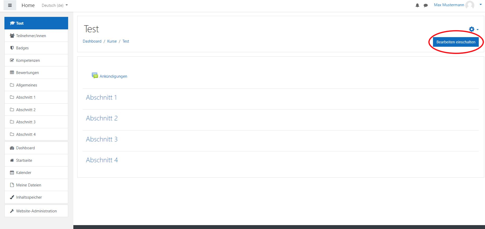
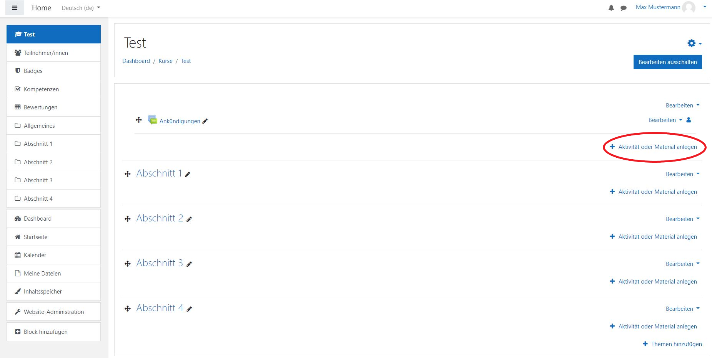
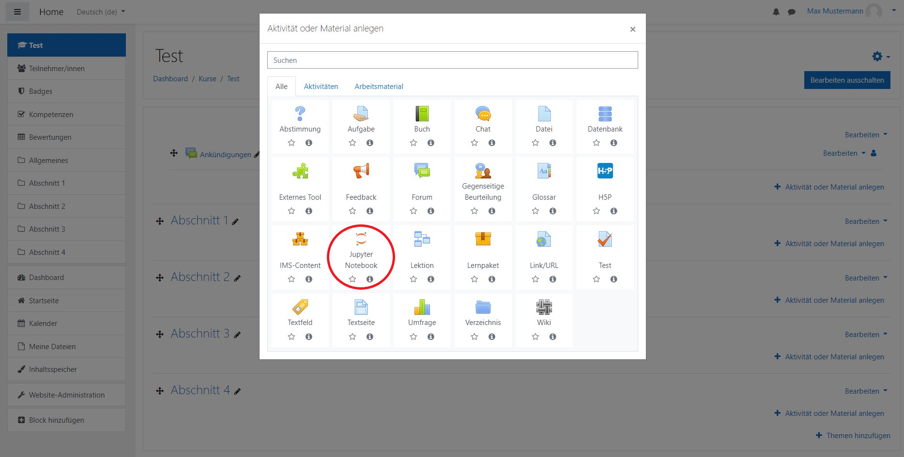
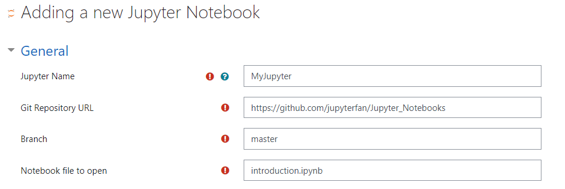
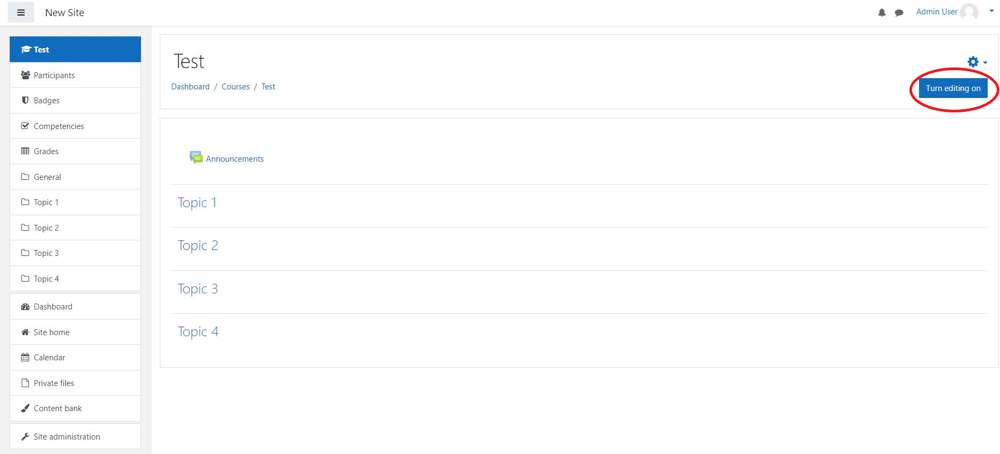
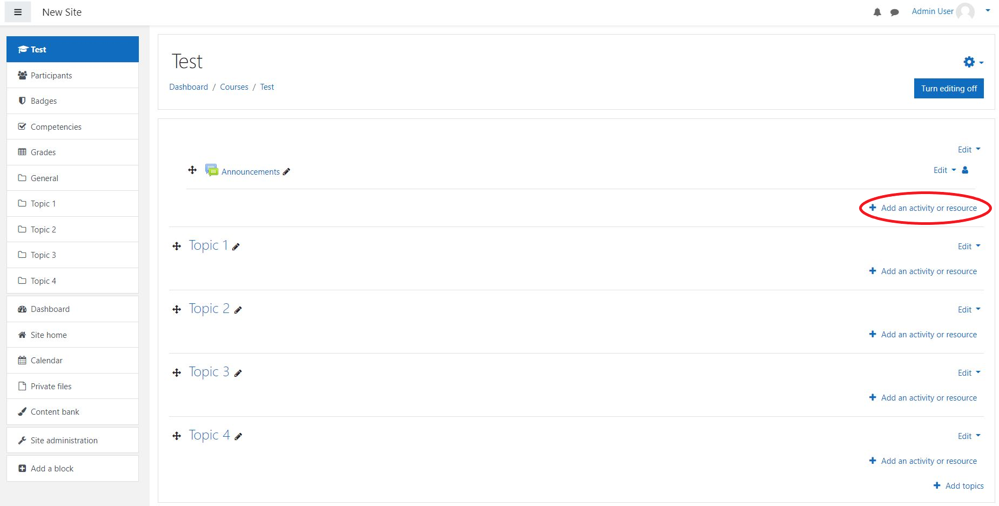
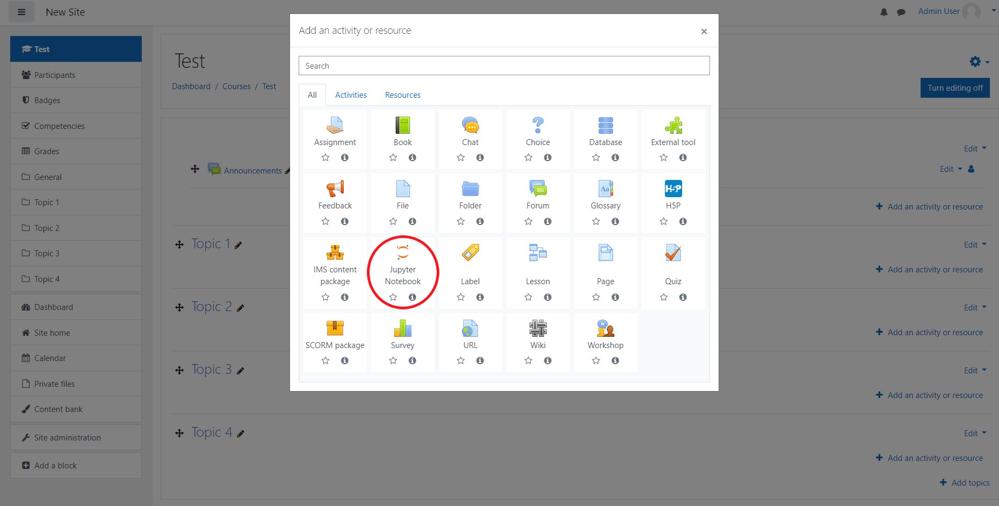

# Lehrer Dokumentation / Teacher Documentation

## Deutsch
Dieses Dokument soll als Anleitung für Lehrkräfte dienen, die das __Jupyter Notebook__ Plugin in ihrem Moodle Kurs einrichten wollen.\
Es wird erklärt wie Lehrende ein Jupter Notebook einem Kurs hinzufügen können sowie spezifische Einstellungen vornehmen können.

### Voraussetzungen
Um dieses Plugin verwenden zu können sollte es zuvor auf der Moodle Seite installiert worden sein.\
Außerdem ist eine laufende Instanz von JupyterHub erforderlich.\
Dies sollte zuvor von Ihrem IT-Administrator eingerichtet worden sein.\
Weitere Informationen dazu finden Sie in der IT-Administrator Dokumentation.

### Einbindung des Plugins in einen Kurs
1. Navigieren Sie zur __Startseite__.
2. Wählen Sie den Kurs aus, indem Sie das Plugin verwenden möchten.
3. Aktivieren Sie die Bearbeitung  mit __Bearbeiten einschalten__ oben rechts.
   
4. Klicken Sie auf __"Aktivität oder Material anlegen"__ und wählen Sie das __Jupyter Notebook__ Plugin.
   
   
5. Geben Sie einen beliebigen Namen für ihre Jupyter Instanz an.\
    Sie sollten einen Link zu einem Git-Respository (z. B. [GitLab](https://gitlab.com/) oder [GitHub](https://github.com/)) erhalten haben, indem die zu bearbeitenden Jupyter  Notebooks hinterlegt sind.\
    Nun geben Sie in die dafür vorgesehenen Felder folgendes ein: ihren erhaltenen Link, den Branch (der Standardbranch heißt in GitHub `master` und in GitLab `main`) sowie das Jupyter Notebook, das Sie standarmäßig öffnen wollen.\
    Dies könnte beispielsweise so aussehen:
    
6. Falls erwünscht, können Moodle spezifische Einstellungen auf dieser Seite vorgenommen werden.  
7. Nun kann gespeichert und angezeigt werden.

## English
This document is intended as a guide for teachers who want to set up the __Jupyter Notebook__ plugin in their Moodle course.\
It explains how instructors can add a Jupyter Notebook to a course and how to set specific preferences.

### Prerequisites
To make use of this plugin it should be installed on your Moodle site. Also, a running instance of JupyterHub is necessary.\
This should have been set up by your IT-administrator beforehand.\
For further information on that regard please refer to the IT-administrator documentation.

### Add plugin to course
1. Go to __Site Home__.
2. Click on the course you want to use the plugin in.
3. __Turn editing on__ at the top right.
   
4. Click on __"Add an activity or resource"__ and add the __Jupyter Notebook__ plugin as an activity.
   
   
5. Put in a name for your Jupyter Instance.\
   You should have received a link to a Git repository (e.g. [GitLab](https://gitlab.com/) or [GitHub](https://github.com/)) containing the Jupyter Notebooks you want to edit.\
    Now enter the following in the provided fields: your received link, the branch (the default branch is called `master` in GitHub and `main` in GitLab) and the Jupyter Notebook you want to open by default.\
    For example, it might look like this:
    
6. Optionally, specify moodle specifig settings.  
7. Save and return to the course.
