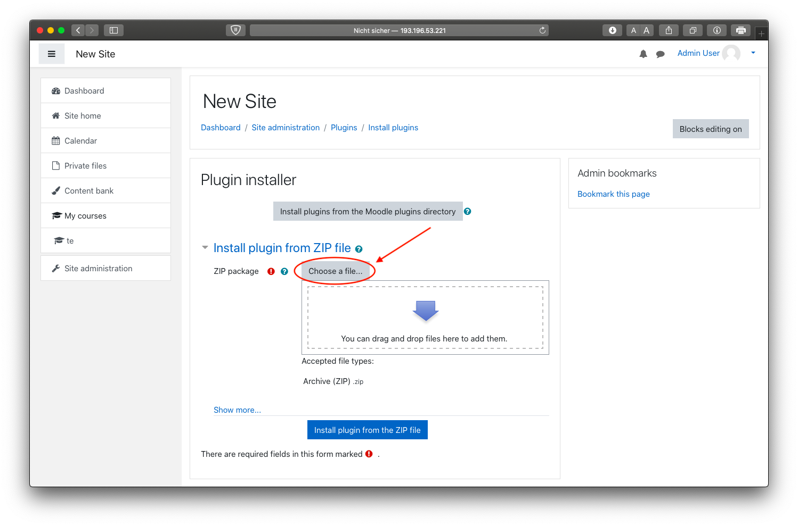
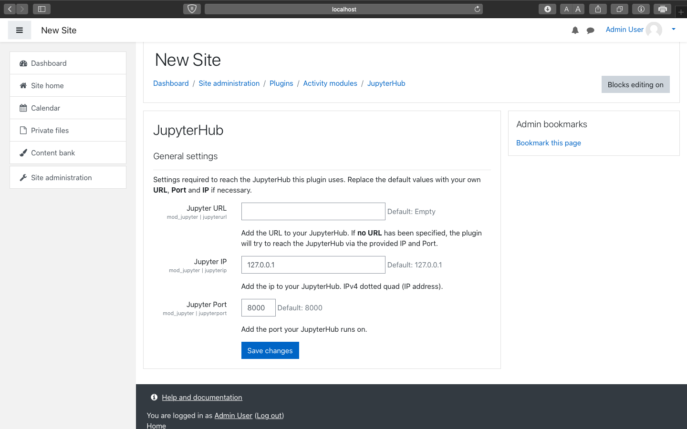

# Lehrer Dokumentation / Teacher Documentation

## Deutsch
Dieses Dokument soll als Anleitung für Lehrkräfte dienen, die das "JupyterNotebook" Plugin in ihrem Moodle Kurs einrichten wollen.\\
Es wird dargestellt wie das Plugin installiert und deinstalliert werden kann.\\
Außerdem wird erklärt wie Lehrende ein JupterNotebook einem Kurs hinzufügen können sowie spezifische Einstellungen vornehmen können.

## Voraussetzungen
Um dieses Plugin nutzen zu können, ist eine laufende Instanz von JupyterHub erforderlich.\\
Diese sollte zuvor von Ihrem IT-Administrator eingerichtet worden sein.\\
Weitere Informationen dazu finden Sie in der IT-Administrator-Dokumentation.

## Installation des Plugins

TODO: deutsche screenshots machen wenn ui auf deutsch \\

1.  Erstelle ine Zip-Datei vom Jupyter Verzeichnis[Jupyter](https://sopra.informatik.uni-stuttgart.de/kib3-student-projects/kib3-stupro-ss-22/-/tree/main/jupyter).\\
    Die Zip-Datei sollte ebenfalls "jupyter" genannt werden.
2.  Öffnen Sie Moodle und melden Sie sich mit einem Administrator Profil an um weitere Einstellungen im Verlauf dieser Anleitung vorzunehmen.
3.  Klicken Sie auf  __Site administration__.
    
4.  Klicken Sie auf __Plugins__.
    
5.  Klicken Sie auf __Install Plugins__.
    
6.  Fügen Sie die "jupyter.zip" datei via "Choose a file..." or "drag and drop" hinzu.
7.  Klicken Sie auf __"Install plugin from the ZIP file"__ button to install the plugin.
8.  Klicken Sie auf __Continue__.
9.  Als nächstes erscheint eine Seite über aktuelle Veröffentlichungsinformtaionen. Scrollen Sie herunter und klicken Sie wieder auf __Continue__ .
10. Nun wird das zu installierende Plugin dargestellt. Um fortzufahren klicken Sie auf __Upgrade Moodle datebase now__.
11. Es sollte eine Erfolgsmeldung über die Installation des Plugins angezeigt werden. Drücken Sie auf __Continue__ .
12. URL/IP settings werden angezeigt. Wenn das JupyterHub Docker setup erfolgreich ausgeführt wurde, werden die vordefinierten Einstellungen bereits korrekt sein und Sie können fortfahren.\\
    Falls ihr IT Administrator Änderungen vorgenommen hat bezüglich einer anderen URL, können Sie hier eine neue URL bzw IP und port angeben für den JupyterHub Server.
13. Klicken Sie auf __Save changes__ um die Installation des Plugins abzuschließen.

### Einbindung des Plugins in einen Kurs
1. Navigieren Sie zu __Site Home__.
2. Wählen Sie den Kurs aus, indem sie das Plugin verwenden möchten.
3. Aktivieren Sie die Bearbeitung  mit __Turn editing on__ oben rechts.
   
4. Klicken Sie auf __"Add an activity or resource"__ und wählen Sie das __Jupyter Notebook__ plugin.
   
   
5. Geben Sie einen Namen für ihre Jupyter Instanz an. \\
   Um ihre Jupyter Notebook Dateien an die im Kurs eingeschriebenen Studierenden zu verteilen, müssen Sie sie zunächst in einem Git-Repository hochladen (z. B. [GitLab](https://gitlab.com/) oder [GitHub](https://github.com/)).\\
   Nun müssen Sie die URL des Repositorys und den zu verwendenden branch angeben (der Standardbranch heißt `main` oder `master`) sowie die Datei angeben, die geöffnet werden soll.
6. Falls erwünscht, können Moodle spezifische Einstellungen auf dieser Seite vorgenommen werden.  
7. Nun kann gespeichert und angezeigt werden.

### Plugin Einstellungen
1. Navigieren Sie zu __Site Administration__.
2. Öffnen Sie __Plugins__.
3. KLicken Sie auf __Manages Activities__ unter __Activity Modules__.
4. Suchen Sie nach __Jupyter Notebook__ und klicken sie auf __Settings__.
   

### Deinstallieren des Plugins
1. Navigieren Sie zu __Site administration__ > __Plugins__ > __Plugins overview__.
2. Suchen Sie nach __JupyterNotebook__ und klicken Sie __Uninstall__.

## English
This document is intended as a guide for teachers who want to set up the "JupyterNotebook" plugin in their Moodle course.
It shows how to install and uninstall the plugin.
Furthermore it explains how instructors can add a JupyterNotebook to a course and how to set specific preferences.

## Prerequisites
To make use of this plugin a running instance of JupyterHub is necessary.\\
This should have been set up by your IT-administrator beforehand.\\
For further information on that regard please refer to the IT-administrator documentation.

### Install Plugin
1.  Get a zip version the directory [Jupyter](https://sopra.informatik.uni-stuttgart.de/kib3-student-projects/kib3-stupro-ss-22/-/tree/main/jupyter).\\
    The zip file has to be named "jupyter" as well.
2.  Open and login to Moodle. You have to log in with an adminstrator account to set the following preferences.
3.  Click on __Site administration__.
    
4.  Click on __Plugins__.
    
5.  Click on __Install Plugins__.
    
6.  Add the "jupyter.zip" file via "Choose a file..." or "drag and drop".
7.  Click on __"Install plugin from the ZIP file"__ button to install the plugin.
8.  Click on __Continue__.
9.  A page about current release information will appear. Scroll down and click on __Continue__ again.
10. The next page displays the plugin you are about to install. To install the plugin, click on __Upgrade Moodle datebase now__.
11. The next page should confirm a successful installation. Click on __Continue__ to progress further.
12. Now the URL/IP settings of the plugin show. If the provided JupyterHub Docker setup is set up and used, the default values will already be correct.\\
    However, if your IT-administrator made changes to the configuration of the URL/IP you can enter a new URL or IP and the port of the JupyterHub server.\\
13. Click on __Save changes__ to finish the installation of the plugin.

### Add plugin to course
1. Go to __Site Home__.
2. Click on the course you want to use the plugin in.
3. __Turn editing on__ on the top right.
   
4. Click on __"Add an activity or resource"__ and add the __Jupyter Notebook__ plugin as an activity.
   
   
5. Put in a name for your Jupyter Instance.\\
   To distribute Jupyter Notebook files to students enrolled in the course, you need to upload them to a remote git repository (i.e., [GitLab](https://gitlab.com/) or [GitHub](https://github.com/)).\\
   When including the plugin in a Moodle course, you need to provide the URL of the repository, the branch you want to use (the default branch is called `main` or `master`), and specify the file you want to be opened.
6. Optionally, specify moodle specifig settings.  
7. Save and return to the course.

### Plugin Settings
1. Go to __Site Administration__.
2. Open __Plugins__.
3. Click on __Manages Activities__ which can be found under __Activity Modules__.
4. Find the Jupyter Plugin and click on it to find the settings.
   

### Uninstall the Plugin
1. Go to __Site administration__ > __Plugins__ > __Plugins overview__.
2. Look for __JupyterNotebook__ and press __Uninstall__.